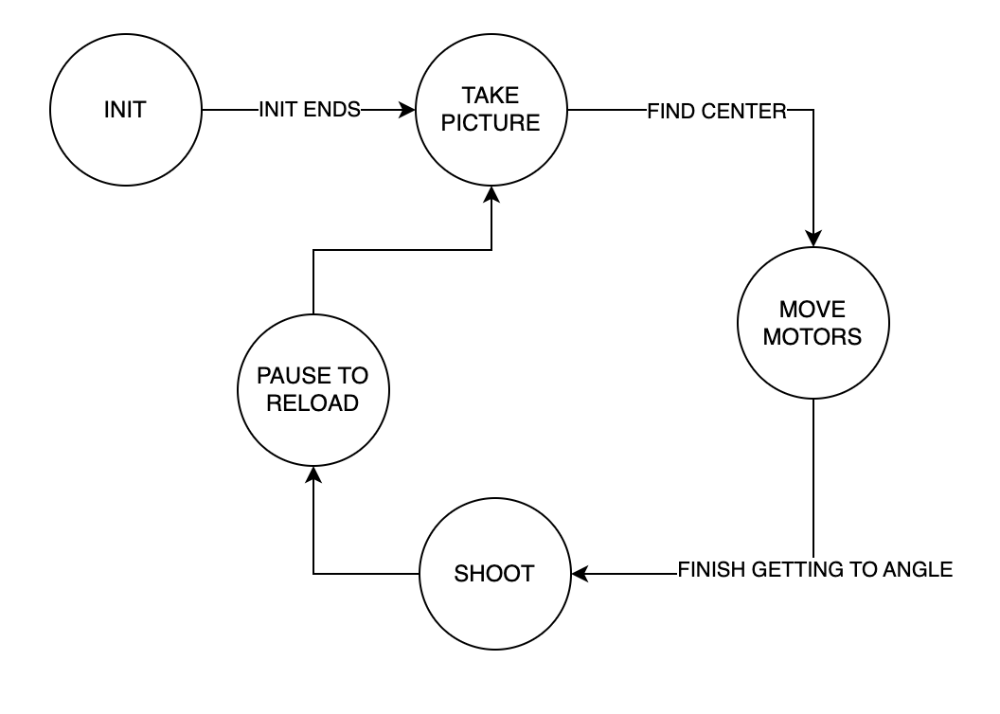
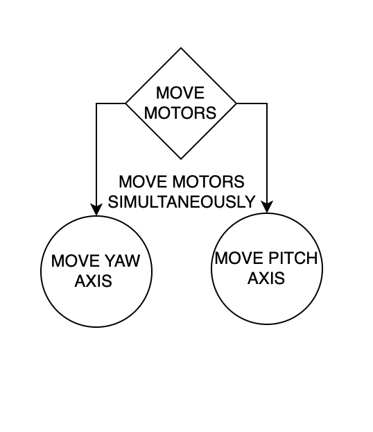
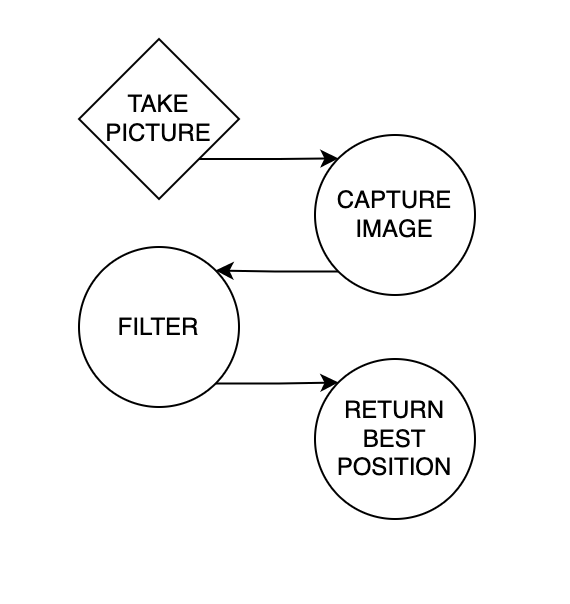

# ME405_TermProject
Created by Tristan de Lemos, Trenten Spicer, Rees Verleur

Shown below is the FSM for our system.

For the motor task and the take picture task, we have state machines as well.

