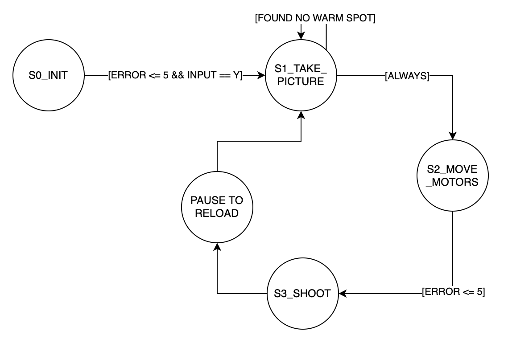

"""! \mainpage My Personal Index Page
 
  @section Software_Design 
  
  The main code of our software is in the main.py file. This is where all other classes from the other files are instantiated.
  This is also where the state diagram of the project is located.
  
  We added functionality to the camera file to create mlx_cam_mod.py, that would obtain the centroid and calcuate the angle at
  which to shoot at.
  The files that move the motors are encoder_driver.py, motor_driver.py and pid_control.py.
  The file that moves the servo is servo.py.
  
  
  
 
    Here is our State Machine Design
    

    
    

  
 
  @subsection Motor State 
 
      Here is our Motor FSM
      \image html motor_task.png
  
 
 @subsection Picture State 
 
      Here is our Image FSM
      \image html picture_task.png
"""
